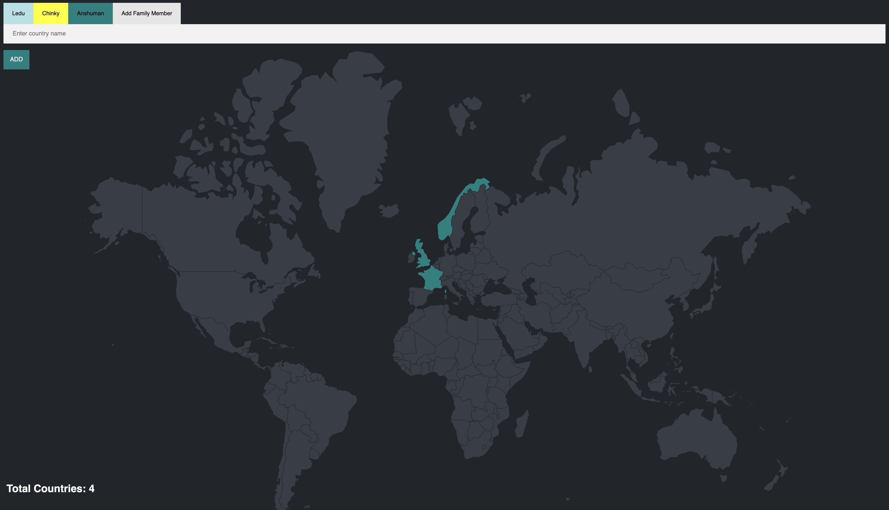

# Family Travel Tracker

A personalized travel tracking application designed for families. This project allows each family member to manage their travel history through unique user interfaces. Travel data is sourced from a countries.csv file and can also be manually updated. All records are securely stored in a PostgreSQL database for efficient data management.

---

## 📸 Screenshots

---

## ✨ Features

- Individual User Interfaces: Each family member has a personalized dashboard to manage their travel data.
- Comprehensive Travel History: Tracks visited countries from countries.csv and allows manual additions.
- Database Storage: All travel records are securely stored in a PostgreSQL database for reliable and organized data handling.
- Data Visualization: Displays clear and easy-to-navigate travel data.
  
---

## ⚙️ Tech Stack

- EJS: For rendering dynamic HTML templates.
- JavaScript: To add functionality and interactivity.
- PostgreSQL: To manage and store travel data.
